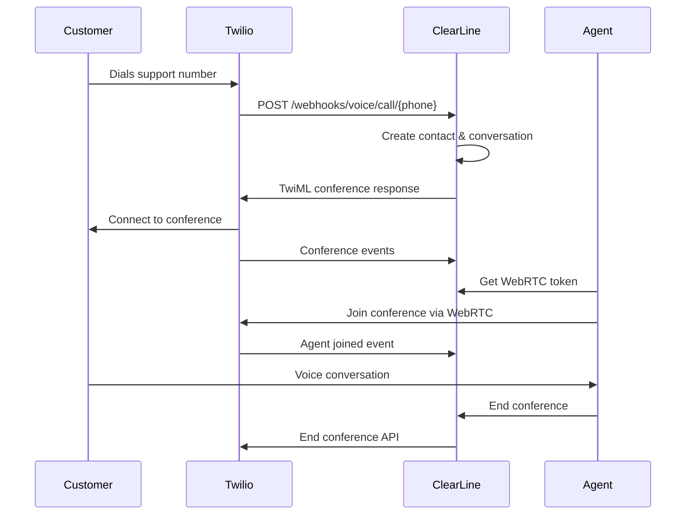
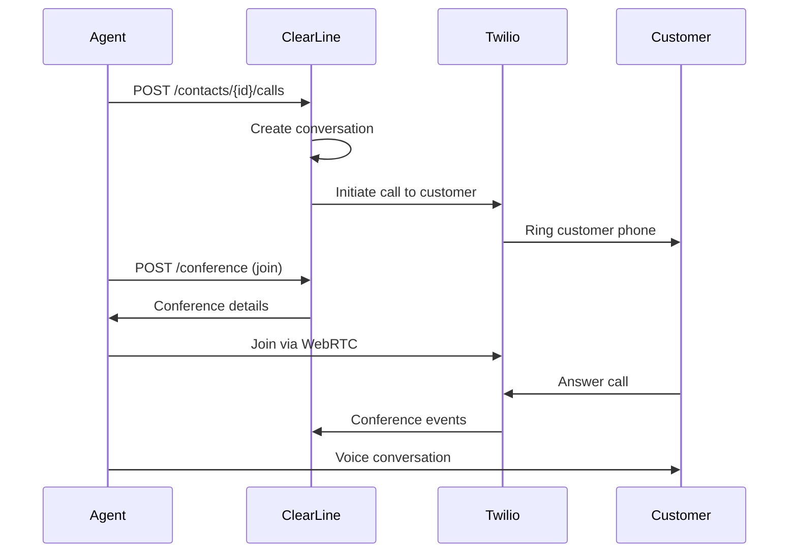

# Voice Channel Implementation Guide

This guide provides comprehensive documentation for implementing and using the voice channel functionality in ClearLine Laravel.

## Table of Contents

1. [Overview](#overview)
2. [Architecture](#architecture)
3. [Setup & Configuration](#setup--configuration)
4. [API Reference](#api-reference)
5. [Call Flows](#call-flows)
6. [WebRTC Integration](#webrtc-integration)
7. [Webhook Configuration](#webhook-configuration)
8. [Troubleshooting](#troubleshooting)
9. [Best Practices](#best-practices)

## Overview

The voice channel provides comprehensive voice calling functionality through Twilio integration, supporting:

- **Inbound Calls**: Automatic conversation creation from customer calls
- **Outbound Calls**: Agent-initiated calls to contacts
- **Conference Management**: Multi-party conferences with WebRTC support
- **Call Tracking**: Real-time status updates and duration tracking
- **Message Integration**: Voice activities in conversation timeline

## Architecture

### Components

```
┌─────────────────┐    ┌─────────────────┐    ┌─────────────────┐
│   Twilio API    │    │  ClearLine API  │    │  Agent Browser  │
│                 │    │                 │    │                 │
│ • Call Control  │◄──►│ • Actions       │◄──►│ • WebRTC SDK    │
│ • Webhooks      │    │ • Services      │    │ • Dashboard     │
│ • Conference    │    │ • Controllers   │    │ • Call Controls │
└─────────────────┘    └─────────────────┘    └─────────────────┘
```

### Key Classes

#### Actions (Business Logic)
- `InitiateOutboundCallAction` - Start outbound calls
- `ProcessCallStatusUpdateAction` - Handle Twilio status updates
- `ProcessConferenceEventAction` - Manage conference events
- `JoinConferenceAction` - Agent conference joining
- `EndConferenceAction` - Conference termination
- `CreateCallMessageAction` - Voice message management

#### Services (Complex Operations)
- `Voice\Provider\Twilio\AdapterService` - Call initiation
- `Voice\Provider\Twilio\TokenService` - WebRTC token generation
- `Voice\Provider\Twilio\ConferenceService` - Conference management
- `Voice\CallStatus\ManagerService` - Status transitions
- `Voice\Conference\ManagerService` - Event processing

#### Controllers
- `ConferenceController` - Conference API endpoints
- `CallsController` - Outbound call initiation
- `VoiceController` - Webhook handling

## Setup & Configuration

### 1. Twilio Account Setup

#### Required Twilio Resources
```bash
# 1. Twilio Account (get from console.twilio.com)
TWILIO_ACCOUNT_SID=ACxxxxxxxxxxxxxxxxxxxxxxxxxxxxx
TWILIO_AUTH_TOKEN=your_auth_token_here

# 2. API Key (for WebRTC tokens)
TWILIO_API_KEY_SID=SKxxxxxxxxxxxxxxxxxxxxxxxxxxxxx
TWILIO_API_KEY_SECRET=your_api_key_secret_here

# 3. TwiML Application (for agent calls)
TWILIO_TWIML_APP_SID=APxxxxxxxxxxxxxxxxxxxxxxxxxxxxx

# 4. Phone Number (purchased from Twilio)
TWILIO_PHONE_NUMBER=+1234567890
```

#### TwiML Application Configuration
Create a TwiML Application in Twilio Console with:
- **Voice URL**: `https://your-domain.com/api/v1/webhooks/voice/call/{phone}`
- **Voice Method**: POST
- **Status Callback URL**: `https://your-domain.com/api/v1/webhooks/voice/status/{phone}`
- **Status Callback Method**: POST

### 2. Laravel Configuration

#### Install Dependencies
```bash
composer require twilio/sdk:^8.3
```

#### Environment Variables
```env
# Twilio Configuration
TWILIO_ACCOUNT_SID=ACxxxxxxxxxxxxxxxxxxxxxxxxxxxxx
TWILIO_AUTH_TOKEN=your_auth_token_here
TWILIO_API_KEY_SID=SKxxxxxxxxxxxxxxxxxxxxxxxxxxxxx
TWILIO_API_KEY_SECRET=your_api_key_secret_here

# Application URLs
APP_URL=https://your-domain.com
```

### 3. Create Voice Channel

```bash
curl -X POST /api/v1/accounts/1/channels/voice \
  -H "Authorization: Bearer {token}" \
  -H "Content-Type: application/json" \
  -d '{
    "name": "Support Hotline",
    "phone_number": "+1234567890",
    "provider": "twilio",
    "provider_config": {
      "account_sid": "ACxxxxxxxxxxxxxxxxxxxxxxxxxxxxx",
      "auth_token": "your_auth_token_here",
      "api_key_sid": "SKxxxxxxxxxxxxxxxxxxxxxxxxxxxxx",
      "api_key_secret": "your_api_key_secret_here",
      "twiml_app_sid": "APxxxxxxxxxxxxxxxxxxxxxxxxxxxxx"
    }
  }'
```

## API Reference

### Channel Management

#### Create Voice Channel
```http
POST /api/v1/accounts/{account}/channels/voice
Authorization: Bearer {token}
Content-Type: application/json

{
  "name": "Support Hotline",
  "phone_number": "+1234567890",
  "provider": "twilio",
  "provider_config": {
    "account_sid": "ACxxxxxxxxxxxxxxxxxxxxxxxxxxxxx",
    "auth_token": "your_auth_token_here",
    "api_key_sid": "SKxxxxxxxxxxxxxxxxxxxxxxxxxxxxx",
    "api_key_secret": "your_api_key_secret_here"
  }
}
```

#### Update Voice Channel
```http
PATCH /api/v1/accounts/{account}/channels/voice/{inbox}
Authorization: Bearer {token}
Content-Type: application/json

{
  "name": "Updated Support Hotline",
  "provider_config": {
    "auth_token": "new_auth_token_here"
  }
}
```

### Call Management

#### Initiate Outbound Call
```http
POST /api/v1/accounts/{account}/contacts/{contact}/calls
Authorization: Bearer {token}
Content-Type: application/json

{
  "inbox_id": 1
}
```

**Response:**
```json
{
  "conversation_id": "101",
  "inbox_id": 1,
  "call_sid": "CAxxxxxxxxxxxxxxxxxxxxxxxxxxxxx",
  "conference_sid": "conf_1"
}
```

#### Get WebRTC Token
```http
GET /api/v1/accounts/{account}/conference/token?inbox_id=1
Authorization: Bearer {token}
```

**Response:**
```json
{
  "token": "eyJ0eXAiOiJKV1QiLCJhbGciOiJIUzI1NiJ9...",
  "identity": "agent-1-account-1",
  "voice_enabled": true,
  "account_sid": "ACxxxxxxxxxxxxxxxxxxxxxxxxxxxxx",
  "agent_id": 1,
  "phone_number": "+1234567890",
  "twiml_endpoint": "https://api.example.com/api/v1/webhooks/voice/call/1234567890"
}
```

#### Join Conference
```http
POST /api/v1/accounts/{account}/conference
Authorization: Bearer {token}
Content-Type: application/json

{
  "conversation_id": "101",
  "call_sid": "CAxxxxxxxxxxxxxxxxxxxxxxxxxxxxx"
}
```

#### End Conference
```http
DELETE /api/v1/accounts/{account}/conference
Authorization: Bearer {token}
Content-Type: application/json

{
  "conversation_id": "101"
}
```

## Call Flows

### Inbound Call Flow



### Outbound Call Flow



## WebRTC Integration

### Frontend Implementation

#### 1. Get Access Token
```javascript
const response = await fetch('/api/v1/accounts/1/conference/token?inbox_id=1', {
  headers: {
    'Authorization': `Bearer ${token}`
  }
});
const tokenData = await response.json();
```

#### 2. Initialize Twilio Device
```javascript
import { Device } from '@twilio/voice-sdk';

const device = new Device(tokenData.token, {
  logLevel: 1,
  answerOnBridge: true
});

device.on('ready', () => {
  console.log('Twilio Device Ready');
});

device.on('error', (error) => {
  console.error('Device Error:', error);
});
```

#### 3. Make Outbound Call
```javascript
// First initiate call via API
const callResponse = await fetch(`/api/v1/accounts/1/contacts/${contactId}/calls`, {
  method: 'POST',
  headers: {
    'Authorization': `Bearer ${token}`,
    'Content-Type': 'application/json'
  },
  body: JSON.stringify({ inbox_id: inboxId })
});

const callData = await callResponse.json();

// Then join conference
const joinResponse = await fetch('/api/v1/accounts/1/conference', {
  method: 'POST',
  headers: {
    'Authorization': `Bearer ${token}`,
    'Content-Type': 'application/json'
  },
  body: JSON.stringify({
    conversation_id: callData.conversation_id,
    call_sid: callData.call_sid
  })
});
```

#### 4. Handle Incoming Calls
```javascript
device.on('incoming', (call) => {
  console.log('Incoming call from:', call.parameters.From);
  
  // Accept the call
  call.accept();
  
  // Handle call events
  call.on('accept', () => {
    console.log('Call accepted');
  });
  
  call.on('disconnect', () => {
    console.log('Call ended');
  });
});
```

## Webhook Configuration

### Twilio Phone Number Configuration

Configure your Twilio phone number with these webhook URLs:

#### Voice Configuration
- **Webhook URL**: `https://your-domain.com/api/v1/webhooks/voice/call/{phone}`
- **HTTP Method**: POST
- **Content Type**: application/x-www-form-urlencoded

#### Status Callbacks
- **Status Callback URL**: `https://your-domain.com/api/v1/webhooks/voice/status/{phone}`
- **Status Callback Events**: All events
- **HTTP Method**: POST

### Webhook Security

#### Validate Twilio Signatures (Recommended)
```php
use Twilio\Security\RequestValidator;

public function validateTwilioSignature(Request $request): bool
{
    $validator = new RequestValidator($this->authToken);
    
    $signature = $request->header('X-Twilio-Signature');
    $url = $request->fullUrl();
    $postData = $request->all();
    
    return $validator->validate($signature, $url, $postData);
}
```

## Troubleshooting

### Common Issues

#### 1. Webhook Not Receiving Calls
**Symptoms**: No incoming calls processed
**Solutions**:
- Verify webhook URL is publicly accessible
- Check Twilio phone number configuration
- Ensure HTTPS is used (required by Twilio)
- Check server logs for errors

#### 2. WebRTC Token Invalid
**Symptoms**: Cannot connect to Twilio Device
**Solutions**:
- Verify API key credentials
- Check token expiration (default 1 hour)
- Ensure TwiML App SID is correct
- Validate account permissions

#### 3. Conference Not Connecting
**Symptoms**: Participants cannot hear each other
**Solutions**:
- Check conference SID generation
- Verify TwiML response format
- Ensure both participants joined conference
- Check Twilio console for conference status

#### 4. Call Status Not Updating
**Symptoms**: Call status stuck in "ringing"
**Solutions**:
- Verify status callback URL configuration
- Check webhook endpoint accessibility
- Review status callback events in Twilio console
- Ensure proper status mapping

### Debug Tools

#### 1. Twilio Console
- Monitor call logs and events
- Check webhook delivery status
- Review TwiML execution logs
- Analyze conference participants

#### 2. Laravel Logs
```bash
tail -f storage/logs/laravel.log | grep -i voice
```

#### 3. Database Queries
```sql
-- Check conversation status
SELECT id, status, additional_attributes 
FROM conversations 
WHERE identifier = 'CAxxxxxxxxxxxxxxxxxxxxxxxxxxxxx';

-- Check voice messages
SELECT content_attributes 
FROM messages 
WHERE content_type = 12 
ORDER BY created_at DESC;
```

## Best Practices

### Security
1. **Validate Webhooks**: Always validate Twilio signatures
2. **Use HTTPS**: Required for production webhooks
3. **Secure Tokens**: Implement token refresh for long sessions
4. **Rate Limiting**: Implement rate limits on API endpoints

### Performance
1. **Async Processing**: Use queues for webhook processing
2. **Database Indexing**: Index conversation identifier field
3. **Caching**: Cache Twilio tokens when possible
4. **Connection Pooling**: Use connection pooling for database

### Monitoring
1. **Call Metrics**: Track call success rates and duration
2. **Error Logging**: Log all Twilio API errors
3. **Webhook Monitoring**: Monitor webhook delivery success
4. **Performance Metrics**: Track API response times

### User Experience
1. **Call Notifications**: Notify agents of incoming calls
2. **Call History**: Maintain call history in conversations
3. **Status Indicators**: Show real-time call status
4. **Error Handling**: Graceful error handling for failed calls

### Scalability
1. **Load Balancing**: Distribute webhook load across servers
2. **Database Sharding**: Consider sharding for high volume
3. **CDN**: Use CDN for static assets
4. **Horizontal Scaling**: Scale application servers as needed

## Integration Examples

### React Component Example
```jsx
import { Device } from '@twilio/voice-sdk';
import { useState, useEffect } from 'react';

function VoiceCall({ contactId, inboxId, token }) {
  const [device, setDevice] = useState(null);
  const [call, setCall] = useState(null);
  const [status, setStatus] = useState('idle');

  useEffect(() => {
    initializeDevice();
  }, []);

  const initializeDevice = async () => {
    try {
      const response = await fetch(`/api/v1/accounts/1/conference/token?inbox_id=${inboxId}`, {
        headers: { 'Authorization': `Bearer ${token}` }
      });
      const tokenData = await response.json();
      
      const twilioDevice = new Device(tokenData.token);
      twilioDevice.on('ready', () => setStatus('ready'));
      twilioDevice.on('error', (error) => console.error(error));
      
      setDevice(twilioDevice);
    } catch (error) {
      console.error('Failed to initialize device:', error);
    }
  };

  const makeCall = async () => {
    try {
      setStatus('calling');
      
      // Initiate call via API
      const response = await fetch(`/api/v1/accounts/1/contacts/${contactId}/calls`, {
        method: 'POST',
        headers: {
          'Authorization': `Bearer ${token}`,
          'Content-Type': 'application/json'
        },
        body: JSON.stringify({ inbox_id: inboxId })
      });
      
      const callData = await response.json();
      
      // Join conference
      await fetch('/api/v1/accounts/1/conference', {
        method: 'POST',
        headers: {
          'Authorization': `Bearer ${token}`,
          'Content-Type': 'application/json'
        },
        body: JSON.stringify({
          conversation_id: callData.conversation_id,
          call_sid: callData.call_sid
        })
      });
      
      setStatus('connected');
    } catch (error) {
      console.error('Call failed:', error);
      setStatus('error');
    }
  };

  const endCall = async () => {
    if (call) {
      call.disconnect();
    }
    setStatus('idle');
  };

  return (
    <div>
      <p>Status: {status}</p>
      {status === 'ready' && (
        <button onClick={makeCall}>Call Contact</button>
      )}
      {status === 'connected' && (
        <button onClick={endCall}>End Call</button>
      )}
    </div>
  );
}
```

This comprehensive guide covers all aspects of the voice channel implementation, from setup to advanced integration patterns.